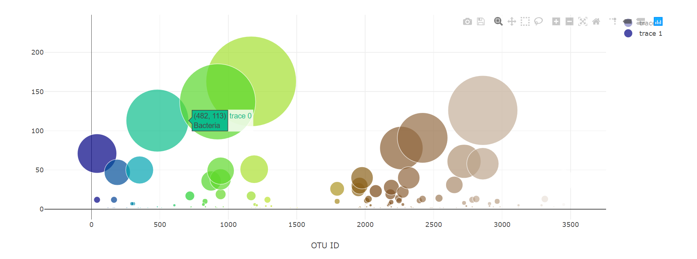

# Belly Button Biodiversity Analysis

## Data Visualization Dashboard

The Belly Button Analysis dashboard is available for a preview at [https://belly-button-biodiversity-jy.herokuapp.com](https://belly-button-biodiversity-jy.herokuapp.com).

 
------------------

Belly Button Biodiversity Analysis uses an interactive dashboard to explore the [Belly Button Biodiversity Showcase DataSet](http://robdunnlab.com/projects/belly-button-biodiversity/).

Interactive charts for the dashboard were build using Plotly.js

## Plotly.js Pie Chart

## Plotly.js Bubble Chart

